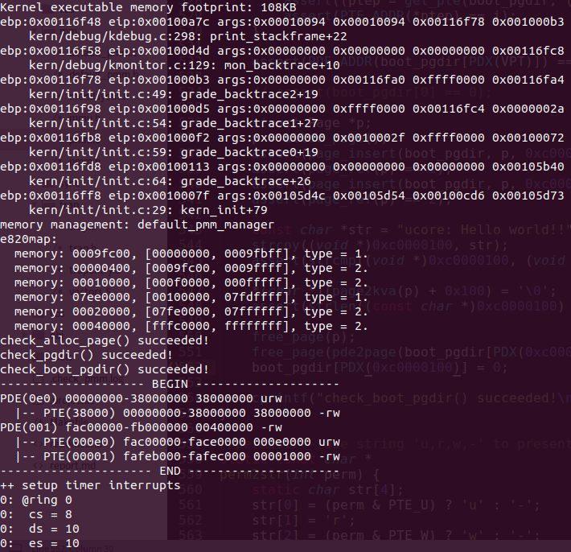

# Lab2

> 计64 翁家翌 2016011446 

## 练习1

1. 修改 `default_alloc_pages` 函数：把原来插入到链表头的方法删了，改成先判断是否还剩空间，如果有的话在page后面插一个新的property为剩下的数目的表，然后再把page删掉
2. 修改 `default_free_pages` 函数：把原来的插入删了，使用一个循环遍历一下新维护出来的表要添加到哪个位置上，然后插入即可

改进：可以使用更高级的数据结构来维护，比如splay、B树等。

我尝试着在free的时候不用第二次循环来查找插入节点，但是失败了：因为base是不断变化的，无法在没循环完之前就能预测该在哪个位置插入进去。

## 练习2

翻译注释即可。

根据 `kern/mm/mmu.h` 中的相关代码（line 235-244），PTE的每个部分组成含义如下：

| 位    | 名称  | 含义                                                      |
| ----- | ----- | --------------------------------------------------------- |
| 0     | P     | 页面是否在内存中                                          |
| 1     | W     | 页面是否可写                                              |
| 2     | U     | 0表示页表中任何页面只能内核态访问，否则用户态可能可以访问 |
| 3     | PWT   | 1表示缓存Write Through，否则Write Back                    |
| 4     | PCD   | 1表示不缓存，否则缓存                                     |
| 5     | A     | 在上次清零之后，该页是否被读写过                          |
| 6     | D     | 在上次清零之后，该页是否被写过                            |
| 7     | PS    | 页大小，1为4MB，0为4KB；ucore强制设为0                    |
| 7-8   | MBZ   | 必须为0                                                   |
| 9-11  | AVAIL | 提供给用户程序使用                                        |
| 12-31 | INDEX | 页基址                                                    |

PDE和PTE在代码中看起来后面几位的含义一致，不再复述。

如果ucore执行过程中访问内存，出现了页访问异常，根据 https://chyyuu.gitbooks.io/ucore_os_docs/content/lab3/lab3_4_page_fault_handler.html ，CPU把引起页访问异常的线性地址装到寄存器CR2中，并给出了出错码errorCode，说明了页访问异常的类型。并且CPU在当前内核栈保存当前被打断的程序现场，即依次压入当前被打断程序使用的EFLAGS，CS，EIP，errorCode。随后查询IDT找到中断服务程序入口点，把例程的地址加载到CS和EIP寄存器中，开始执行中断服务例程。

## 练习3

翻译注释即可。

Page每一项与页表中的页目录项和页表项有对应关系。它们高20位均为物理页号，根据宏 `pa2page` 与 `page2pa`，可以根据高20位建立起它们的映射关系，都是基址+偏移量，只不过基址不同。

如果希望虚拟地址与物理地址相等，则需要修改以下内容：

1. 修改 `kern/mm/memlayout.h` 中的 `KERNBASE` 为 `0x00000000`（line 56）
2. 修改 `tools/kernel.ld` 中的基址为 `0x00100000` （line 10）
3. 修改 `kern/init/entry.S` 中：注释掉27-28行，避免删掉谭院士最开始手动建立的页表；注释掉58-59行，取消第一个临时映射，反正kernbase改成0之后这两句话就是错的，padding根本不对
4. 相应修改 `kern/mm/pmm.c` 中的测试

具体可查看 [https://github.com/oscourse-tsinghua/os2019-Trinkle23897/compare/lab2-zero](https://github.com/oscourse-tsinghua/os2019-Trinkle23897/compare/lab2-zero)

效果如下所示，可以看见PDE的第一项是恒等映射：

## 总结

#### 本实验中重要的知识点，以及与对应的OS原理中的知识点

1. 首次匹配
2. x86分页机制
3. 二级页表

#### 本实验中没有对应的

1. 最佳匹配
2. 最差匹配
3. 碎片整理
4. 反置页表
