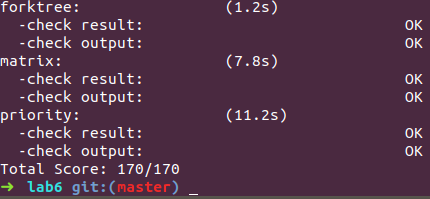

# Lab6

> 计64 翁家翌 2016011446

##  练习1

在填充完 lab1 - lab5 的代码之后，我发现 priority 也过了……

`sched_class` 一共6个成员，如下：

1. `name`：字符串
2. `init`：初始化，包括数据结构、计数器
3. `enqueue`：添加一个新的进程到数据结构中，并且计数器+1
4. `dequeue`：从数据结构中删除一个指定的进程，并且计数器-1
5. `pick_next`：从数据结构中选择下一个被调度的进程
6. `proc_tick`：响应时钟中断。基于时间片的调度算法每次会减少当前进程的时间片，如果减到0则标记为需要重新调度

假设当前剩余时间片为10，描述过程如下：

1. 前九次时钟中断，时间片-1之后正常运行
2. 在第十次中断时，会将当前进程的 `need_resched` 设置为1.
3. 从 `trap` 函数实现可知，在 `trap_dispatch` 之后，由于 `need_resched = 1`，因此进入 `schedule` 进入调度器
   1. 将当前进程塞到数据结构中，并且取出数据结构中优先级最高的进程
   2. 设置取出的进程为当前进程，如果取出的进程为空则设置为 `idleproc`
4. 内核调用 `proc_run` 运行当前被选中进程

多级反馈队列调度算法设计如下：

1. `init`：初始化所有队列，并把所有进程优先级设置为最高
2. `enqueue`：如果当前进程时间片为0，不改变优先级并放入对应队列中；否则降低优先级并放入对应队列中；随后将该进程时间片设置为对应优先级拥有的时间片
3. `dequeue`：从对应优先级队列中取出即可
4. `pick_next`：根据优先级算法，判断是否要转移优先级队列；取出当前维护的队列中最靠前的进程并返回
5. `proc_tick`：无需修改

## 练习2

参考原来的RR代码写新的stride

1. `BIG_STRIDE` 设置为 `0x7fffffff`：由于 `max_stride - min_stride <= PASS_MAX <= BIG_STRIDE`，并且需要保证两个进程 `stride` 差值在32位有符号整数表示范围内，所以 `max_stride - min_stride <= 0x7fffffff`
2. 初始化 `run_pool` 设置为空
3. 修改 `enqueue` 和 `dequeue`，改成左偏树插入和删除的接口
4. `pick_next` 改成取堆顶的元素，并且计算stride

在写完代码之后，我发现 priority 反而过不去了……正好卡在15-16秒那个时间，真迷

Update: 过了两个月之后重跑，发现这个问题不存在 

## 总结

#### 本实验中重要的知识点，以及与对应的OS原理中的知识点

1. 时间片轮转算法
2. Stride 调度算法
3. 调度框架

#### 本实验中没有对应的

1. 其他调度算法
2. 实时调度
3. 多处理器调度
4. 优先级反置
